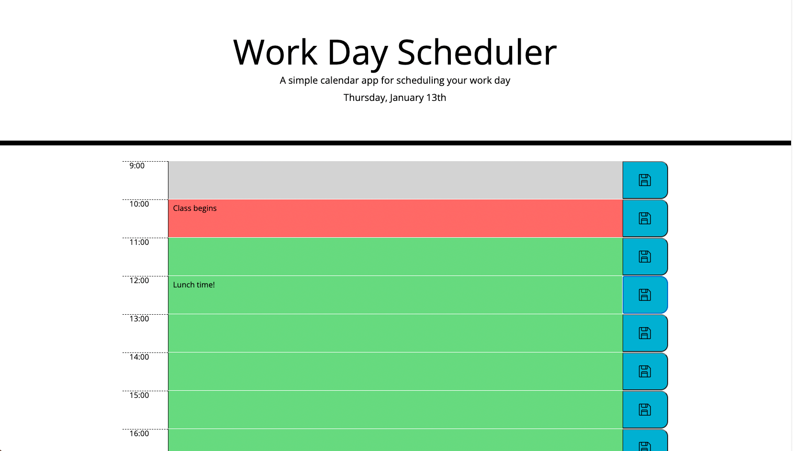

# Day Planner

Developer: Sydney Mercier

For: UT Austin Coding Bootcamp

Deployed: https://sygmo.github.io/day-planner/

## Overview
This is a simple calendar app, specifically intended for scheduling the work day from 9-5pm. Users may enter events or tasks on any hour and save those inputs with a save button. The hour blocks are colored by time of day - gray for past hours, red for the present hour, and green for future hours.

## Development

Some starter code and styles were provided by the coding camp, but the main functionality of dynamically generating the timeblocks and implementing scheduling was left to me. User-entered events are saved to localstorage so they persist even after a page reload. Also, the generated timeblock elements each have unique class names so that user input can be easily associated with a specific hour. 

While the app works as required, there are a few changes I would like to make in the future. Currently, the process of saving inputs and populating timeblocks with text from localstorage involves an excessive amount of DOM traversal. Rather than giving unique identifiers to the timeblock elements, it may be better to apply them to more specific elements, like the textarea elements that contain user text. 

